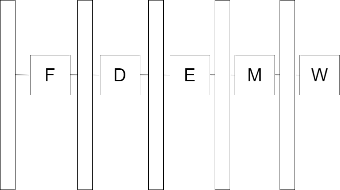
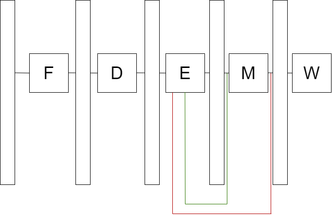

# 流水线回顾

我们已经学过流水线了，现在我们回顾一下流水线的思路。

[TOC]

## 1 从单周期到流水线

单周期CPU的模型：

五个阶段执行同一条指令，且为级联，延迟叠加。根据划分的思路，一个简单的解决方案是多周期CPU，每周期执行一个阶段，每条指令5个周期。多周期的缺点是元件利用率低。

在单周期CPU模型中，我们也需要有维持输入信号的机制。引入流水线寄存器，我们有了流水线CPU的初步模型：

这里，每个流水级数都在执行一条指令，可以用以下这句话来描述：

> 吐故纳新。	——《庄子·刻意》

## 2 预测（Prediction）、提交（Commit）与撤销（Rollback）

程序员写代码时，希望自己的程序是按顺序、一条一条执行的；对应单周期CPU模型。

任意流水线CPU，在改变全局状态（写内存、写通用寄存器等）方面，行为都应与单周期CPU一致（顺序且exactly once），不能出现乱序、少执行、重复执行等现象。

M和W可抽象为提交，改变了处理器全局状态。F和D和E为预测，未改变全局状态，遇到问题可以撤销。

## 3 流水线优化原则

CPI是CPU的一个性能指标，但不是唯一的性能指标。单周期CPU的CPI是1，比大家写过的大多数流水线CPU都低。

频率也是很重要的一个指标。在优化流水线、降低CPI时，要检查频率是否会大幅下降。

频率取决于电路中的关键路径，与输入无关。比如，我的CPU中实现了单周期的除法，那最大频率就受限于这条除法器关键路径。如果提高频率使这条路径时序违例，即使输入没有除法指令，电路也是非法的。

### 3.1 例：用转发解决冲突

在流水线CPU中，如果前一条指令的结果还没提交，后一条指令就要用到这个结果，就产生了数据冲突。

我们从冲突的本质出发，尝试数据冲突的所有情况，并寻找适用场景：

| 冲突情况（本表未体现优先级） | 数据来源                 | 处理方法 |
| ---------------------------- | ------------------------ | -------- |
| 第$i$条指令在D阶段需要数据   | 第$i-1$条指令通过ALU算出 |          |
| 第$i$条指令在D阶段需要数据   | 第$i-1$条指令从内存读出  |          |
| 第$i$条指令在D阶段需要数据   | 第$i-2$条指令通过ALU算出 |          |
| 第$i$条指令在D阶段需要数据   | 第$i-2$条指令从内存读出  |          |
| 第$i$条指令在D阶段需要数据   | 第$i-3$条指令通过ALU算出 |          |
| 第$i$条指令在D阶段需要数据   | 第$i-3$条指令从内存读出  |          |
| 第$i$条指令在E阶段需要数据   | 第$i-1$条指令通过ALU算出 |          |
| To be continued...           |                          |          |

需要注意，转发的来源必须是流水线寄存器的输出，而不能是高延迟组合逻辑部件的输出。

