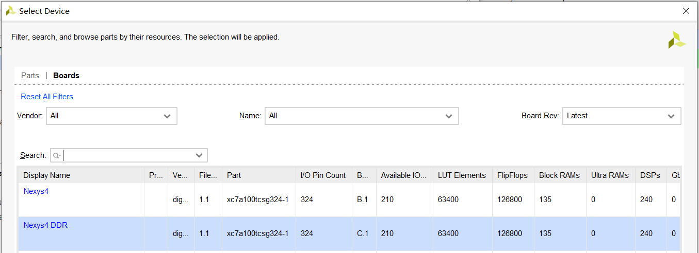

# 我们的实验板

[TOC]

## 1 实验板接口

约束文件`Nexys4DDR_Master.xdc`包括了我们实验板的输入输出，用`get_ports`声明了top模块合法的接口。

时钟作为输入，频率为100MHz。

```
set_property -dict { PACKAGE_PIN E3    IOSTANDARD LVCMOS33 } [get_ports { clk }]; #IO_L12P_T1_MRCC_35 Sch=clk100mhz
```

`create_clock`语句不是实验板相关语句，而是综合相关。

```
create_clock -add -name sys_clk_pin -period 10.00 -waveform {0 5} [get_ports {clk}];
```

约束文件声明了接下来几个系列的I/O：

```
# Switches
# LEDs
# 7 segment display
# Buttons
# Pmod Headers
# VGA Connector
# Micro SD Connector
# Accelerometer
# Temperature Sensor
# Omnidirectional Microphone
# PWM Audio Amplifier
# USB-RS232 Interface
# USB HID (PS/2)
# Ethernet PHY
# Quad SPI Flash
```

需要注意的是，七段数码管部分的I/O接口，8个数码管共用7位显示信号，所以需要做一些额外的处理。思路是在极短的时间内做一次扫描。

|          | $T_0$             | $T_1$             | $T_2$             | $T_3$             |
| -------- | ----------------- | ----------------- | ----------------- | ----------------- |
| AN[0]    | 有效              |                   |                   |                   |
| AN[1]    |                   | 有效              |                   |                   |
| AN[2]    |                   |                   | 有效              |                   |
| AN[3]    |                   |                   |                   | 有效              |
| A2G[6:0] | 第0个数码管的数据 | 第1个数码管的数据 | 第2个数码管的数据 | 第3个数码管的数据 |

`counter`是用来时钟分频，数码管采样频率较低，不能直接用100MHz的时钟。我们的实验用的是$100MHz >> 8$的频率，显示时有一些模糊，改成$100MHz >> 13$会好一些。也要注意，采样频率降低，可能会丢失一些数据。

```verilog
logic [15:0] counter;
logic [7:0][6:0] segs;

always_ff @(posedge clk) begin
    if (~resetn) begin
        counter <= '0;
    end else begin
        counter <= counter + 1;
    end
end

assign A2G = segs[counter[15:13]];
assign AN = ~({7'b0, resetn} << counter[15:13]);
```

可选择加一级输出寄存器。

## 2 运算资源

我们已经知道，用与非门可以实现任意组合逻辑电路，加上D触发器就可以实现任意数字电路。

FPGA实验板的原理是，板上已有可编程的逻辑资源，通过编程和布线来实现各种电路。

综合完成后，我们可以在`项目目录/.runs/syth_1/`里打开`.dcp`（design checkpoint）文件，点左上角的`File->export->netlist`导出网表文件，读一读我们写的电路生成了怎样的“汇编代码”。

在选板子的界面，我们可以看到实验板上的逻辑资源信息。



### 2.1 输入输出

`I/O Pin Count`是输入输出相关。

### 2.2 组合逻辑资源LUT

Look Up Table（查找表，LUT）是FPGA上的组合逻辑运算资源。它是一个可编程的真值表。LUT6能实现任意6输入的组合逻辑电路。

```verilog
LUT6 #(
	.INIT(64'hAFA0CFCFAFA0C0C0)
) \aluout_OBUF[0]_inst_i_4 (
    .I0(\aluout_OBUF[0]_inst_i_1_0 ),
    .I1(data2),
    .I2(alufunc_OBUF[1]),
    .I3(aluout0__21_carry_n_7),
    .I4(alufunc_OBUF[0]),
    .I5(aluout0_carry_n_7),
    .O(\aluout_OBUF[0]_inst_i_4_n_0 )
);
```

其行为可以描述如下：

```verilog
module myLUT6 #(
    parameter logic [63:0] INIT = 64'b0
) (
    input logic [5:0] in,
    output logic out
);
    logic [63:0] truth_table;
    assign truth_table = INIT;
    
    assign out = truth_table[in];
    
endmodule
```

针对LUT的特点，可以对代码进行一定的优化。

除了LUT，这部分资源还包括`MUX`和`CARRY`。

### 2.3 触发器资源Filpflop

实验板上的触发器包括`FDCE`（clear，异步复位）, `FDRE`（reset， 同步复位）, `FDPE`（preset，异步置数）, `FDSE`（set，同步置数）。

触发器每组8个，类型必须相同，共用`C`, `CE`, `S/R`。设计时，尽量使用同一种触发器。

```verilog
FDRE #(
	.INIT(1'b0)
)\counter_reg[15] (
    .C(CLK),
    .CE(\<const1>),
	.D(counter[15]),
    .Q(\counter_reg_n_0_[15]),
	.R(SR)
);
```

### 2.4 集成存储器Block RAM

每个BRAM可存4KB数据。

### 2.5 数字信号处理模块DSP

DSP常用作乘法。

在乘法器IP核的配置里，选择`use mult`和`speed optimized`就可用DSP来算乘法。