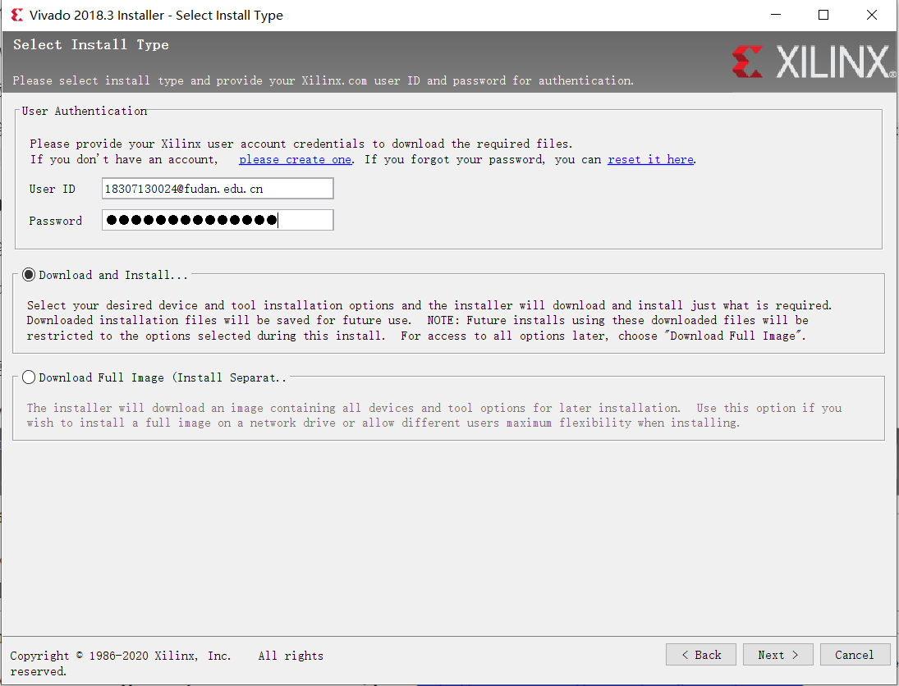
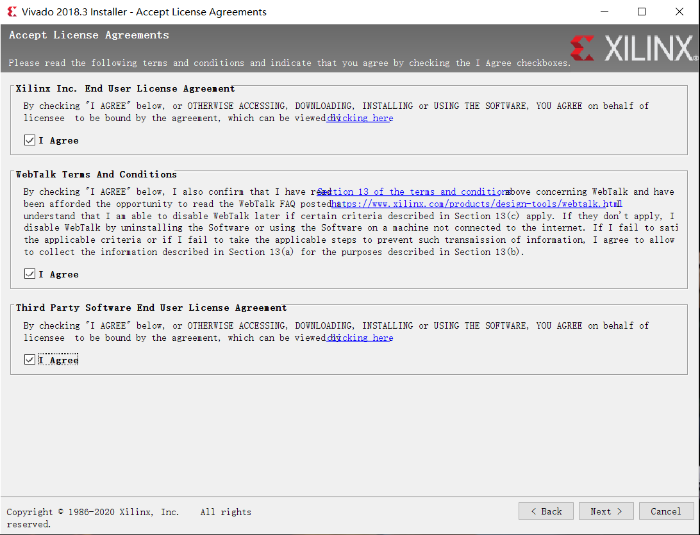
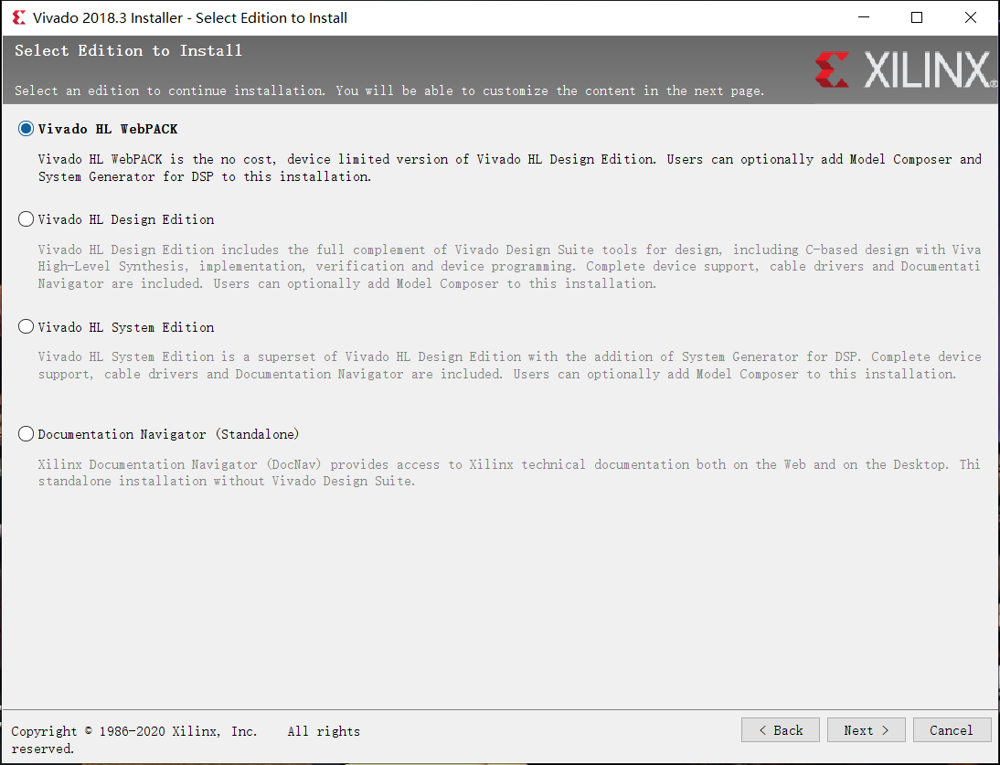
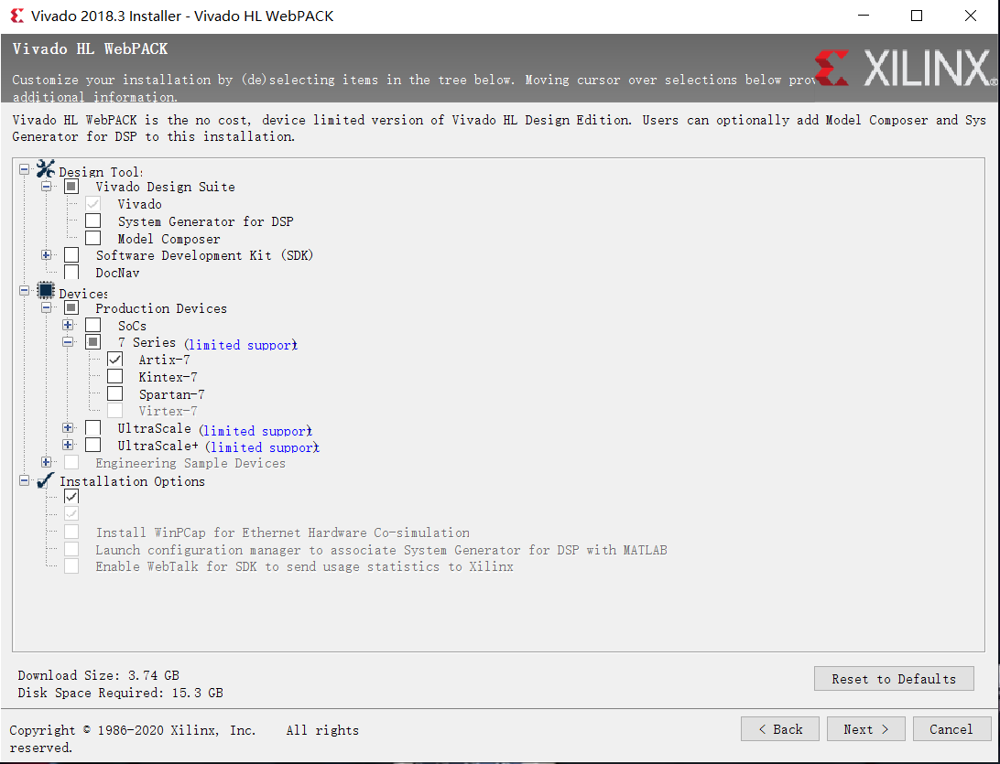
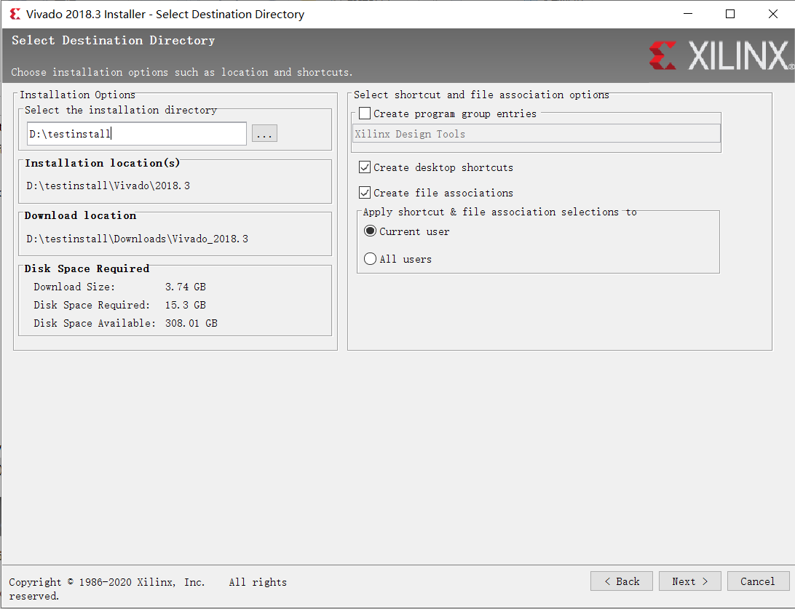
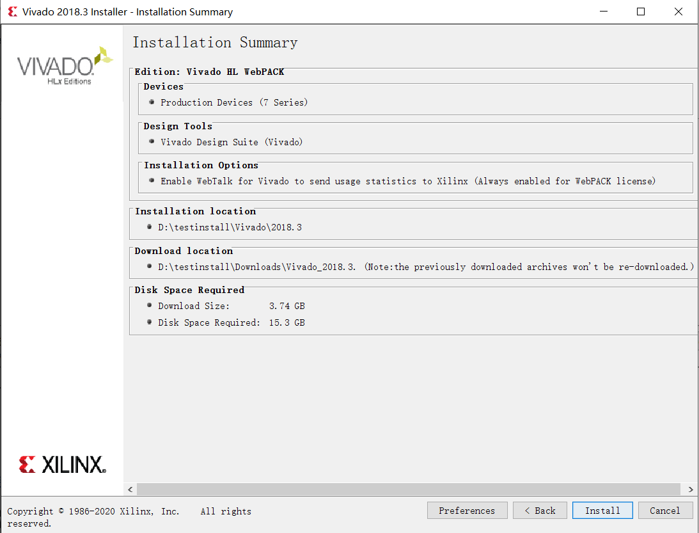
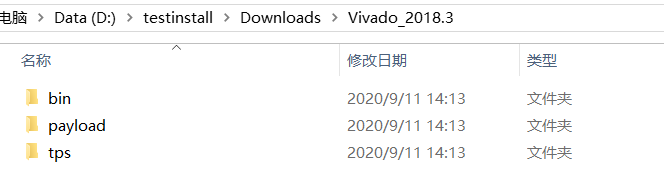
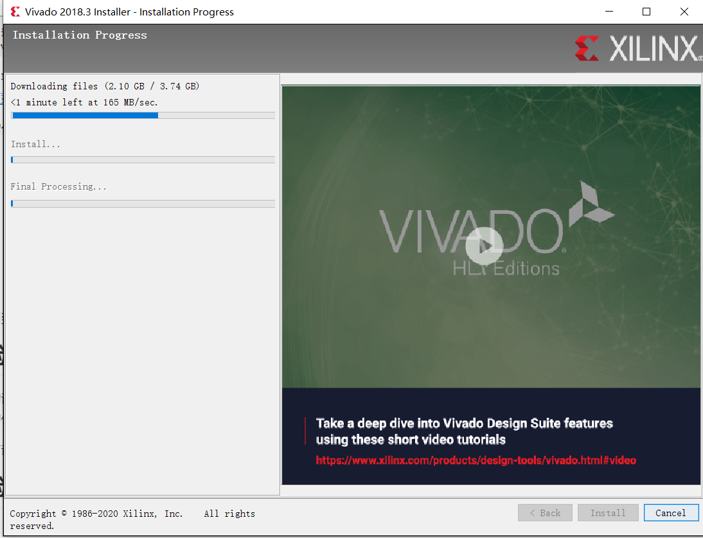

# 数字逻辑与部件设计 实验部分-01.开发流程（上）

We will start with installing the software.

------

[TOC]

## 安装Vivado 2018.3

以下为 `Vivado 2018.3`安装教程。

### Step0：安装环境

Vivado支持Windows和Linux操作系统。如果你是Mac用户，需要在虚拟机上安装并使用Vivado。

Vivado需要20GB左右的硬盘空间。

### Step1：注册Xilinx账户

Xilinx是Vivado软件的开发商。安装Vivado需要Xilinx账户，这是[注册链接](https://china.xilinx.com/registration/create-account.html)

### Step2：下载安装包

Vivado的安装包有`在线安装`和`完整安装`两种，使用这两种安装包的安装步骤也有不同。

助教推荐使用 **在线安装**版本。

助教提供了在线安装包的钉盘下载链接，有效期至 `2020-10-12`：

Windows版Vivado：[Windows版在线安装包](https://space.dingtalk.com/s/gwHOAlIvJwLOQ5TVLAPaACBlZGIxYWQyODMxMzY0Mzc0YWVkNTIxYzE1MTY3OTdmNA)，提取码： `KCP2`

Linux版Vivado：[Linux版在线安装包](https://space.dingtalk.com/s/gwHOAlIvKQLOQ5TVLAPaACAzOGQyN2JjYmJjMDQ0YjBkOWI5NTUyNWQ3ZDY2NmRmNQ)，提取码： `xDsd`

两种安装包均可在Xilinx官网的[Vivado下载链接](https://china.xilinx.com/support/download/index.html/content/xilinx/zh/downloadNav/vivado-design-tools/2018-3.html)上下载，下载内容为 `Vivado Design Suite - HLx 版本 - 2018.3 Full Product Installation`

### Step3：安装流程

以下为 `Windows在线安装版本`的安装流程演示。完整安装包、Linux系统安装流程类似。

打开安装包后，可能会跳出来`有新版本`的提示，我们不安装新版本，点`Next`。

接下来填写用户名和密码，再点`Next`。



接下来要点三个`I Agree`，然后点`Next`，如图：



接下来选择要安装的edition，我们选择 `Vivado HL Webpack`，然后点 `Next`，如图：



接下来选择安装内容。选择的内容如图所示，然后点 `Next`：



接下来选择安装路径，然后点 `Next`（注：点这个 `Next`后，下个界面先别点 `install`按钮），如图：



进入`Installation Summary`界面：



下载内容大小`3.74GB(Windows)`、`4.31GB(Linux)` ，但通过这个安装包下载这些内容可能很慢，于是助教把需要下载的东西打包成 `zip压缩包` 放到钉盘上了，链接如下：

Windows版：[Windows版下载内容](https://space.dingtalk.com/s/gwHOAlHhHwLOQ5TVLAPaACA1YjZkZDI0NWZhNGY0NzdiOTY4MDlhNDJlODkxZDhkZA) 提取码： `Wgwc`。

Linux版：[Linux版下载内容](https://space.dingtalk.com/s/gwHOAlHhHQLOQ5TVLAPaACA2ZTUxNWFhNjAxNDQ0NzU0YmE1MWE3MWIxOWRmMWM0MA) 提取码: `12pF`。

把压缩包里的文件解压到 `你输入的安装路径/Downloads`里，解压后的文件夹层次应当是这样的：



随后回到安装程序，点击 `Install`，程序会很快结束下载步骤，进行安装：



慢慢等进度条走完即可。

在Linux系统上安装Vivado的，需要在terminal里执行以下指令：

```bash
cd <VivadoInstallDir>/data/xicom/cable_drivers/lin64/install_script/install_drivers/install_drivers
sudo ./install_drivers
```

其中 `<VivadoInstallDir>`为 `Vivado`安装路径，后缀为 `Vivado/版本号`，和上文`Installation Summary`图中 `Installation Location`一致。

## 体验上板

今后的课程中，我们会写一些硬件代码。Vivado帮我们把这些硬件代码转换成二进制文件，我们把二进制文件装载进实验板，就能观察我们写的代码在实验板上的行为了。

我们先不写代码，只需要将助教事先准备好的二进制文件装载进实验板即可。

### Step 1：把实验板连接到电脑上

用盒子里的数据线把实验板连到电脑上，打开开关。

按下实验板上的 `CPU_RESETN`按钮，数码管上会有动画，这是实验板自带的。

### Step 2：打开Hardware Manager

打开 `Vivado`软件，点击 `Open Hardware Manager`，然后点击 `Open Target`， `Auto Connect`。

如果 `Hardware`界面没有实验板信息，请检查如下几点：

* 实验板是否已开机
* 数据线两端接口是否松动

### Step 3：烧写bit文件

点击 `Program Device`，将elearning上的 `display.bit`文件加载进实验板。

这个 `.bit`文件是助教模仿实验板自带的演示工程实现的，右边八个开关可以调速度：开关全部拨下的速度和实验板自带的演示工程相近，拨上则加速。

## 附录

### 数逻实验课学什么？

树莓派开发板已配备了CPU和操作系统。树莓派的开发，是用高级语言（如 `Python`）写软件代码交给板上CPU和OS来控制板上外设。

通过本课程的学习，大家将掌握：

* 如何实现**专用硬件**完成所需要的功能、完成对外设的控制
* 如何用**硬件描述语言**实现所需要的硬件
* 如何用**软件**来调试硬件
* 对**通用硬件**有基本的认识

实验课发布包的主要内容为：

#### SystemVerilog语法与应用

**SystemVerilog**是一种**硬件描述语言**。它的一部分语法和**C语言**类似，所以比较容易上手。

**SystemVerilog**以很少的语法为基础——掌握了这些语法，就可以实现所有硬件了。这部分语法是必修的。

在讲某些数字部件时，还会引入一些**SystemVerilog**的进阶语法，目的是让代码更简洁、清晰。


可能还会有一些拓展，比如：

#### Chisel语法与应用

**Chisel**， `Constructing Hardware In a Scala Embedded Language`，是嵌入在高级语言 `Scala`的一种硬件描述语言。相比 `SystemVerilog`，`Chisel`支持面向对象、类型推断等特性，不仅可以大大减少硬件的代码量，代码的可读性、可移植性也大大提高。 开发者不仅可以用`Chisel`设计电路，更可以设计**电路生成器**，让AI也可以进行硬件设计。


实验的拓展部分还在筹划当中，欢迎向助教们提出改进建议！