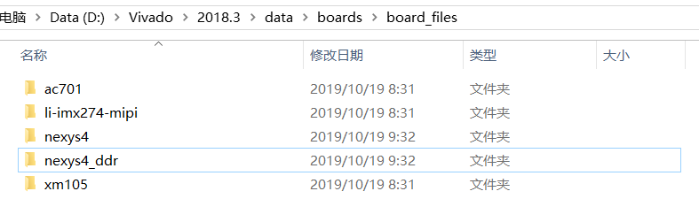
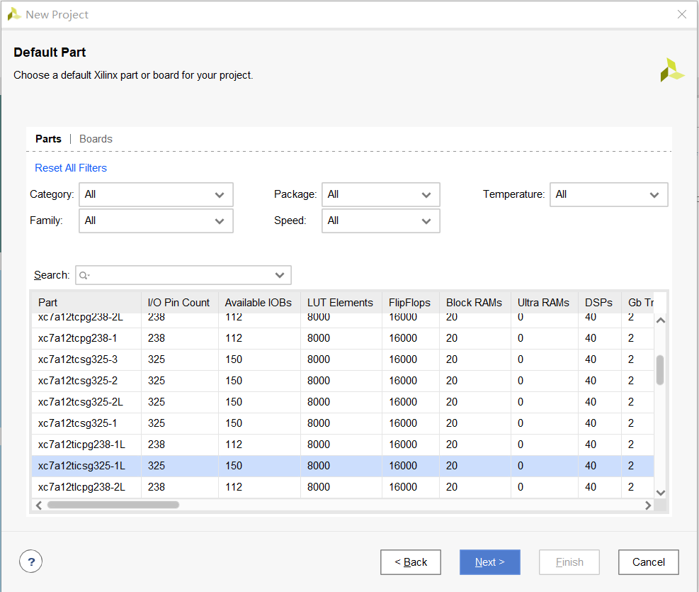
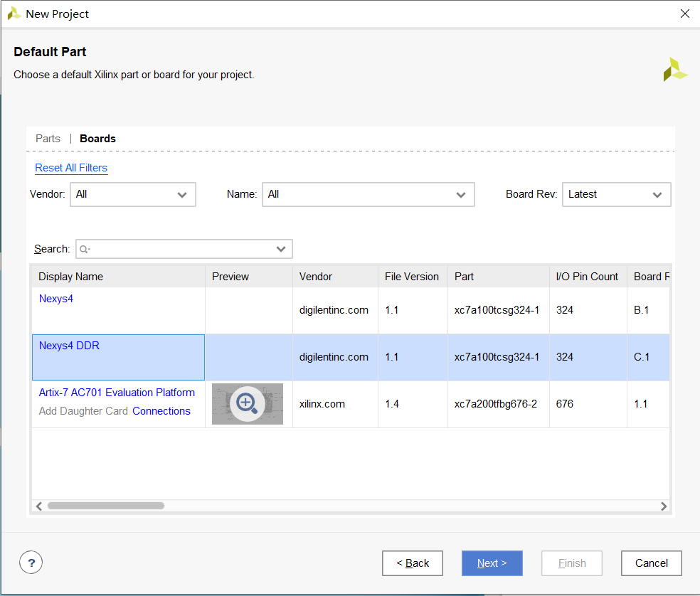
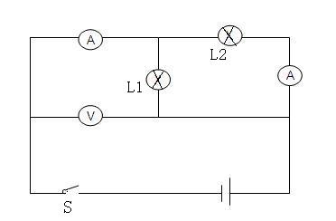

# 数字逻辑与部件设计 实验部分-02.开发流程（中）

Convert code to circuit.

[TOC]

## 将已有的代码生成bit文件

我们已经学会了如何将bit文件载入实验板。现在，我们来学一下，有了硬件代码，如何生成bit文件。

### Step 0：在Vivado安装目录中添加实验板信息

将 `board_files.zip`的两个文件夹解压至 `<VivadoInstallDir>/data/boards/board_files/`。

解压后的目录应如图所示：



### Step 1：新建项目

打开Vivado，点击 `Create Project`，新建一个项目。

选择项目路径后，点下一步选择 `RTL Project` ，然后一直点击下一步，直到 `Default Part` 这个界面：



点击上方的 `Boards`，选择 `Nexys4 DDR`，然后一直点下一步，直到项目新建成功。



### Step 2：运行tcl脚本添加源文件

运行 `source/`目录下的 `sources.tcl`，一键添加所有需要的源文件。

`sources.tcl`的内容如下：

```tcl
# 进入当前目录
cd [file dirname [info script]]

# 添加所需源文件
add_files top.sv
add_files controller.sv

# 设置顶层文件
set_property top top [current_fileset]

cd [file dirname [info script]]

# 添加引脚约束文件
add_files -fileset constrs_1 -norecurse Nexys4DDR_Master.xdc

# 设置仿真文件
set_property SOURCE_SET sources_1 [get_filesets sim_1]
# 添加仿真文件
add_files -fileset sim_1 -norecurse sim.sv
# 设置仿真顶层
set_property top sim [get_filesets sim_1]
set_property top_lib xil_defaultlib [get_filesets sim_1]
```

以上提到了几种文件：

* `源文件`：模块设计文件。
* `顶层文件`：也属于源文件，作用是将已经写好的数字模块与实验板的引脚相连。
* `引脚约束文件`：实验板的配置文件。
* `仿真文件`和 `仿真顶层` ：仿真用的测试文件。仿真的有关部分在下节课会讲。

这些tcl代码对应的操作都有图形化界面的操作对应。

### Step 3：开启多线程(optional)

在 `Tcl Console`中输入 `set_param general.maxThreads 16`开启多线程模式，对接下来的Step 4有一定的加速效果。

### Step 4：生成bitstream

点击Vivado界面左下角的 `Generate Bitstream`，然后一直选 `Yes`，有默认框的就✔一下，减少今后操作的点击次数。

有一步是确认用多少个job，这个对速度影响不大。

也可在 `Tcl Console`中输入： `reset_run synth_1; launch_runs impl_1 -to_step write_bitstream`

### Step 5：上板

点击左下角的 `Open target` --> `Auto Connect` --> `Program Device`，把默认路径的bitstream（路径应包含 `impl_1/` ）烧写到实验板上。

实验板的现象和上一节课提供的bit文件一样。

## 硬件描述语言简介

**硬件描述语言**(**HDL**, `Hardware Description Language`)，顾名思义，是用来**描述硬件**的语言。

### 硬件描述语言与实际硬件

我们画过很多电路图（那些电路就是硬件），但那些都是小规模的电路。我们需要借助计算机的力量去设计大规模电路，而**硬件描述语言**是我们和计算机通信的桥梁。

这就要求我们了解硬件描述语言与实际硬件之间的关系。

以下是助教的一些学习心得：

* 先有电路（图），再写HDL。
* 用基本元件生成新的部件。掌握新部件对应的HDL写法后，就可以把新部件当成基本元件来使用了。

### 硬件描述语言与C语言

我们将要学习的硬件描述语言**SystemVerilog**，其语法形式和我们已经学过的 **C语言**类似，但它们的本质完全不同。

有人说，硬件描述语言是**并行语言**，C语言是**串行语言**。这个说法是正确的，不过两者差别的内涵在于**程序**与**电路**的差别。

C语言经编译、链接后生成**程序**，而程序是由**指令序列**构成的。

而**电路**（**硬件**）是一个整体，以一个系统的方式运作着。



这是一个简单的并联电路。我们能硬改某个灯上通过的电流吗？我们只能改变元器件接入电路系统的方式。

## SystemVerilog基础语法：二进制位

### 变量声明

在数字世界中，万物皆为0和1。在SystemVerilog中，万物皆为**logic**。

```verilog
logic a;
logic b;
```

SV的变量命名规则与C语言类似，比如 `避开关键字`、`区分大小写`等。每句语句也以分号结尾。

变量的实际意义是电路中的节点。

接下来是**向量**：

```verilog
logic [15:0]c; // 一维向量
logic [15:0][15:0]d, e; /* 二位向量 */
```

SV的向量和C的数组有以下几点不同：

* SV的向量在声明时需确定上下界。
* `logic [15:0]c;`和`logic [0:15]c;`都是合法的，分别代表大端法和小端法。
* `logic [15:0]c;`和`logic c[15:0];`都是合法的，但后者只能`一位一位`地接入电路系统中。
* SV的多维数组没有C中的多维数组寻址模式。


其实，logic是四值逻辑：`0, 1, x, z`。`x`和`z`在真实的电路中不存在，仅在软件仿真时有用。

### 常量

SV的常量形式为`位宽+单引号+数据进制+数据`。需注意：

* 位宽代表常量有多少位二进制。位宽必须为常量。
* 数据进制为一个字符，常用的有二进制(b)，十进制(d)，十六进制(h)。

例：

```
1'b1
1'b0
16'habcd
10'd100
```

### 接入电路系统：assign语句

将变量接入电路系统，有三种方式：

* **assign**语句
* 元件例化
* **always**语句(**always_comb**, **always_ff**, **always_latch**)

先介绍assign语句。

```verilog
logic a;
assign a = 1'b1;
```

SV中，大括号`{}`代表**位拼接**。（代码段用``begin end``）

```verilog
logic [15:0] a, b, c, d;
assign a = 16'b1; // 16'b1 is 0x0001
assign b = {4'b1010, 4'b0101, 4'b1100, 4'b0011};
assign {c, d} = {32'hdeadbeef}; // c is 32'hdead, d is 32'hbeef
```

可以将新变量接入已知变量中：

```verilog
logic [15:0] a, b, c, d;
assign a = 16'b1;
assign b = a;
assign {c, d} = {a, a};
```

大括号`{}`可以实现位扩展：

```verilog
logic [15:0] a;
logic [15:0][15:0] b;
assign a = {16{1'b1}};
assign b = {16{a}};
```

## SystemVerilog基础语法：模块与元件

模块是一个小型电路系统，是数字设计中很重要的一个思想。

### 模块的定义

模块定义的语法如下：

```verilog
module ModuleName(
	// ports
);
	// logics
endmodule
```

`module`和`endmodule`为模块定义的关键字

`ModuleName`为模块名。

`// ports`部分为输入输出接口的声明（一般只声明），会用到`input`和`output`关键字。

`// logics`部分为模块内部电路。

以下为一个模块定义的例子：

```verilog
module SignExtend(
    input logic [15:0]a,
    output logic [31:0]b
);
    assign b = {{16{a[15]}}, a};
endmodule
```

### 元件例化：模块接入电路系统

元件例化有几种语法形式：

```Verilog
ModuleName InstanceName1(.ports1(variable1), ports2(variable2), ...); // 变量和端口对应
ModuleName InstanceName2(.ports1, .ports2, ...); // 端口ports1接到同名变量
ModuleName InstanceName3(.ports1(variable3), .*); // 端口ports1接到变量variable3，其他端口都接到同名变量
```

例：

```verilog
module UseSignExtend(
	
);
    logic [16:0] a;
    logic [31:0] b, c ,d;
    SignExtend signextend1(.a(a), .b(c));
    SignExtend signextend2(.a, .b(d));
    SignExtend signextend3(.a, .*);
endmodule

module SignExtend(
    input logic [15:0]a,
    output logic [31:0]b
);
    assign b = {{16{a[15]}}, a};
endmodule
```

有一些代码规范：

* 元件名、模块名和变量名的大小写关系
* 用哪种元件例化的语法形式


注：顶层模块通过约束文件接入实验板，没有例化。

### 更加简便的设计

模块设计和函数设计的初衷是类似的，把整体设计切成部分，简化设计步骤。

画电路图时，也可以把已经学过的电路元件放进电路图里。

### 黑盒

先定义接口，再想怎样设计

## SystemVerilog基础语法：运算符

我们已经学了数字电路的基本元件与门、或门和非门。它们在SV中分别用`&`、`|`、`~`表示。

```verilog
logic [15:0] a, b, c, d, e;
assign c = a & b;
assign d = a | b;
assign e = ~a;
```

`&`和`|`还有另一种用法：

```verilog
logic [3:0] a;
logic b, c;
assign b = |a; // b = a[0] | a[1] | a[2] | a[3]
assign c = &a; // c = a[0] & a[1] & a[2] & a[3]
```

除了基本的逻辑门，SV还支持以下几种运算符：

```verilog
logic [15:0] a, b, c, d, e, f, g, j, k;
logic [15:0] h, i;
assign c = a + b; // adder
assign [15:0] d = a - b;
assign [15:0] e = a << b[3:0]; // shifter
assign [15:0] f = a >> b[3:0]; // shift right logically
assign [15:0] g = a >>> b[3:0]; // shift right arithmetically
assign [31:0] h = a * b; // multiplier
assign [31:0] i = a / b; // divider
assign [15:0] j = (a == b) ? a + 1 : b - 1; // a multiplexer
assign [15:0] k = a ^ b; // XOR
```

SV中运算符所代表的电路都可用`assign`语句接入电路系统中。