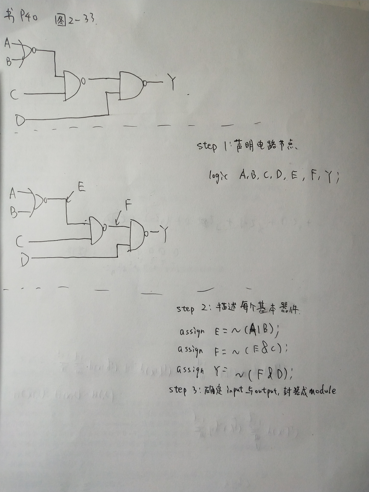

# SystemVerilog语法简介

[TOC]

## 变量

`SystemVerilog`基本变量为`logic`。万物皆为 `logic`。

`SystemVerilog`的每个变量对应着电路中的一个节点。

变量有一位的，也有向量类型。

```verilog
logic a;
logic [15:0] b;
```

## 常量

`SystemVerilog`的常量为若干位0和1的组合。

## 操作符

每个操作符对应一个逻辑门或数字模块。

| 操作符              | 对应电路元件       | 备注                                    |
| ------------------- | ------------------ | --------------------------------------- |
| `&`                 | 与门               | 有缩位的用法                            |
| `|`                 | 或门               | 有缩位的用法                            |
| `~`                 | 非门               |                                         |
| `+`                 | 加法器             |                                         |
| `-`                 | 减法器             |                                         |
| `*`                 | 单周期乘法器       | 输出位数为输入的两倍                    |
| `/`                 | 单周期除法器       |                                         |
| `>`， `<`等比较符号 | 比较器             | 有一个操作数含`X`时，结果未知           |
| `<<`，`>>>`，`>>`   | 移位器（多种实现） | 右操作数的位数应为左操作数位数的对数    |
| `? : `              | 二选一选择器       |                                         |
| `++`                |                    | 几乎仅在`for`循环中使用，无对应电路元件 |
| `{}`                | 位绑定或扩位       | 位绑定或扩位                            |
| 无操作符            | 电路直接连线       | 等号左右两边对应同一节点                |

## assign语句

 `assign`语句用于描述可用操作符实现的电路元件，常用于描述已有电路图或简单逻辑。

写法举例：



## 模块、元件例化

`module`是电路设计中很重要的概念，可封装逻辑细节，只暴露接口。

* 在多人协作中，每人写一些模块，可确保每个人写的逻辑独立，也方便拼接。
* 想实现某个功能但写不出电路时，可以先放一个元件，把接口定好，等宏观的电路结构搭好后再实现细节。

模块和元件类似于c++中的类与对象的概念。

元件例化用于描述电路图中的抽象逻辑部件，常用于描述已有电路图。

写法举例：


## always_comb block

`always_comb`代码块用于描述组合逻辑，常用于描述已知逻辑功能、真值表而无法用门电路描述、难以拆分成模块的电路。

`always_comb`可视为一个封闭的模块：其有一定的输入和输出，输出为块内所有语句等号左侧的变量；对模块内，所有语句顺序执行，交换语句顺序可能改变结果（`assign`语句、元件例化语句、各`always_comb`模块间顺序无关）；对模块外，其行为相当于运行完最后一句语句后，一次性对外“展示”所有输出。

`always_comb`描述的行为，由编译器转化为门电路。

`always_comb`中的变量必须在各个情况下都有值，且不应将输出作为输入。（这条对应的电路是锁存器，应避免）

以下介绍一些仅用在`always_comb`或`always_ff`中的语句。

### unique/priority case

`case`语句和C语言的`switch`类似，用于描述`对于某个信号的不同情况，做不同的事`。

```verilog
always_comb begin
    unique case(a) 
        // 各情况无优先级，unique可省略
    endcase
    
    priority case(1'b1) 
        // 各情况有优先级，故priority case后经常跟着常量
    endcase
end
```

### unique/priority if

`if`和`case`的作用类似。

```verilog
always_comb begin
    // 各情况无优先级，少用
    unique if(a == 1'b1) begin
         
    end else if (b == 1'b1) begin
        
    end else begin
        
    end

    // 各情况有优先级，priority可省略
    priority if(a == 1'b1) begin
         
    end else if (b == 1'b1) begin
        
    end else begin
        
    end
end
```

### for循环

`for`循环用于复制电路。循环次数必须显式指出（思考：`for`循环如何映射到电路？）。

和`for`循环相关的语法有`break`，`continue`，其意义和C语言中的一致。

## always_ff block

`always_ff`适用于D触发器模型。

一个最基本的D触发器：

```verilog
logic a, b;
always_ff @(posedge clk) begin
	a <= b; 
end
```

同步复位的D触发器：

```verilog
logic a, b;
always_ff @(posedge clk) begin
    if (~resetn) begin
        a <= '0;
    end else begin
        a <= b;
    end
end
```

异步复位的D触发器：

```verilog
logic a, b;
always_ff @(posedge clk, negedge resetn) begin
    if (~resetn) begin
        a <= '0;
    end else begin
        a <= b;
    end
end
```

带时钟使能的D触发器：

```verilog
logic a, b;
always_ff @(posedge clk) begin
    if (~resetn) begin
        a <= '0;
    end else if(~stall) begin
        a <= b;
    end
end
```

状态机、流水线寄存器写法：

```verilog
logic [31:0]a, a_nxt;

// Filp-flops
always_ff @(posedge clk) begin
    if(~resetn) begin
        a <= '0;
    end else begin
        a <= a_nxt;
    end
end

// Next-state function
always_comb begin
    a_nxt = a;
    
    // set the next state of a
end

// Output function
assign out = |a;
```

`always_ff`代码块内应只描述触发器的功能（可带上`clock enable`，`reset`），次态函数的其他逻辑应在`always_comb`中实现。

## 更多的类型

万物皆为`logic`，对编程者来说比较不友好。比如编码和信息，我们希望用不同的类型来标识它们。

`SystemVerilog`提供了一些语法，使编程者可以拥有更多类型，但本质还是`logic`。

### typedef

```verilog
typedef logic[31:0] uint32_t;
typedef logic[31:0][31:0] cp0_regs_t;

uint32_t a, b;
```

### struct

```verilog
typedef struct packed {
    virtual_addr_t addr;
    logic en;
} read_req_t;

read_req_t read_req;
assign read_req = {
    32'h80000000, 
    1'b1
};

logic k;
assign k = read_req.en;
```

### enum

`enum`多用于编码。

```verilog
typedef enum logic[1:0] {
	INIT, RED, BLUE
} state_t;

state_t state, state_nxt;
```

### union

```verilog
typedef logic[7:0] byte_t;
typedef union packed {
    logic [31:0]a;
    byte_t [3:0]b;
} word_t;
```

## 参数

为了使模块的复用性更高，可以在模块定义时设置参数。

参数被视为常数。

参数可为数值或类型。

```verilog
module #(
	parameter W = 32 // default value
) myAdder1 (
    input logic [W-1:0] a, b,
    output logic [W-1:0] c
);
    assign c = a + b;
endmodule

module #(
    parameter type add_type = logic[31:0]
) myAdder2 (
    input add_type a, b,
    output add_type c
);
    assign c = a + b;
endmodule

module top();
    logic [15:0] a, b, c, d;
    myAdder1 #(.W(16)) adder1(.a, .b, .c);
    myAdder2 #(.add_type(logic [15:0])) adder2(.a, .b, .c(d));
endmodule
```

