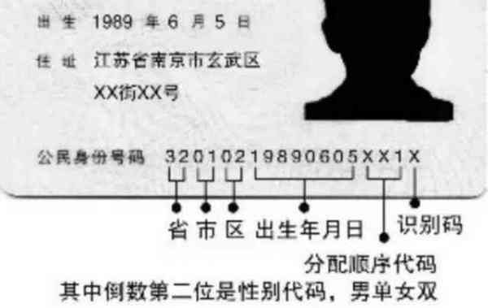

# 实验二 译码与编码的应用

## 实验背景

### 日常应用

​	在上次实验课中，大家已经实现了一个简单的译码器和编码器，在这次实验课中，大家将会体会到译码和编码在实际中的应用。

​	首先我们要明确译码和编码的作用是什么。简单来讲，在生活中，编码就是将一系列的信息按照某个规则编写成一串数字，而译码就是将一串数字按照某个则翻译成对应的信息。例如下图是我国身份证的编码格式：

​	

每个人都有自己对应的身份证号，在你出生的时候，会根据你的登记所在地，生日等信息，按照身份证的编码规则（在此不多赘述），编成一个属于你自己的身份证号。同样，根据一个人的身份证号和编码规则，你也能够很容易得知道这个人的出生地，生日，性别等各种信息。而这，便是编码和译码在生活中的应用。

​	当然，不仅如此，编码和译码在计算机领域之中还有很多其他的应用，例如各类指令集等。在本次实验中，我们将会着重锻炼大家对编码和译码知识的掌握和迁移。

### 编码规则

​	本次实验中，我们将会为大家提供一种新的编码的规则和各种编码，大家需要对其进行译码操作，并输出译码后相关的各种信号（由我们提供）的值。

​	以下是编码规则（参考了MIPS指令集），一条需要被译码的指令一共有32位，指令的运算方式由op和funct唯一决定，以下从左往右分别是从第31位到第0位，且以下所有运算均不需要考虑溢出的情况：

| 指令 | op（6） | imm1（8） | imm2（8） | shamt（3） | (1)  | funct（6） | 作用                       |
| ---- | ------- | --------- | --------- | ---------- | ---- | ---------- | -------------------------- |
| ADD  | 000000  | 8位操作数 | 8位操作数 | x          | 0    | 100000     | imm1与imm2相加             |
| SUB  | 000000  | 8位操作数 | 8位操作数 | x          | 0    | 100010     | imm1-imm2                  |
| SLT  | 000000  | 8位操作数 | 8位操作数 | x          | 0    | 101010     | if imm1<imm2 then 1 else 0 |
| AND  | 000000  | 8位操作数 | 8位操作数 | x          | 0    | 100100     | 与运算                     |
| NOR  | 000000  | 8位操作数 | 8位操作数 | x          | 0    | 100111     | 或非运算                   |
| OR   | 000000  | 8位操作数 | 8位操作数 | x          | 0    | 100101     | 或运算                     |
| XOR  | 000000  | 8位操作数 | 8位操作数 | x          | 0    | 100110     | 异或运算                   |
| NOT  | 000000  | 8位操作数 | x         | x          | 0    | 101111     | 对imm1做否运算             |
| SLL  | 000000  | 8位操作数 | x         | 3位操作数  | 0    | 000000     | 对imm1左移shamt位          |
| SRL  | 000000  | 8位操作数 | x         | 3位操作数  | 0    | 000010     | 对imm1逻辑右移shamt位      |
| SRA  | 000000  | 8位操作数 | x         | 3位操作数  | 0    | 000011     | 对imm1算术右移shamt位      |
| LW   | 100011  | x         | x         | x          | 0    | x          | 读内存                     |
| SW   | 101011  | x         | x         | x          | 0    | x          | 写内存                     |
| J    | 000010  | x         | x         | x          | 0    | x          | 始终跳转                   |
| BEQ  | 000100  | 8位操作数 | 8位操作数 | x          | 0    | x          | imm1 == imm2跳转           |
| BNE  | 000101  | 8位操作数 | 8位操作数 | x          | 0    | x          | imm1 != imm2跳转           |

### 输出信号

- 一个4位的信号，用来告知ALU（算术逻辑单元）需要进行什么运算。（前11条指令经过ALU）

- 一个1位的信号，表明是否写内存。

- 一个1位的信号，表明是否读内存。

- 一个1位的信号，表明是否跳转。（如果指令是跳转相关的指令，则在译码的时候顺便判断是否跳转）

- imm1的值8位

- imm2的值8位

- shamt的值3位

*ALU相关的4位信号的编码方式并不唯一，请各位自行选择合适的编码方式，前提是自己要能理解自己的编码方式，且尽可能简单地编码。

## 实验内容

1、输入一个32位的数，对其进行译码操作，并输出相关信号，信号的名称，编码方式若未提前说明，则可以自由发挥，但输出的具体信号含义请参考之前的“输出信号”部分。

  	**本次实验输出的信号会作为实验四的输入信号，即实验四需要用到本次实验完成的工作，希望各位能够按要求进行，避免之后的实验出现问题。**

