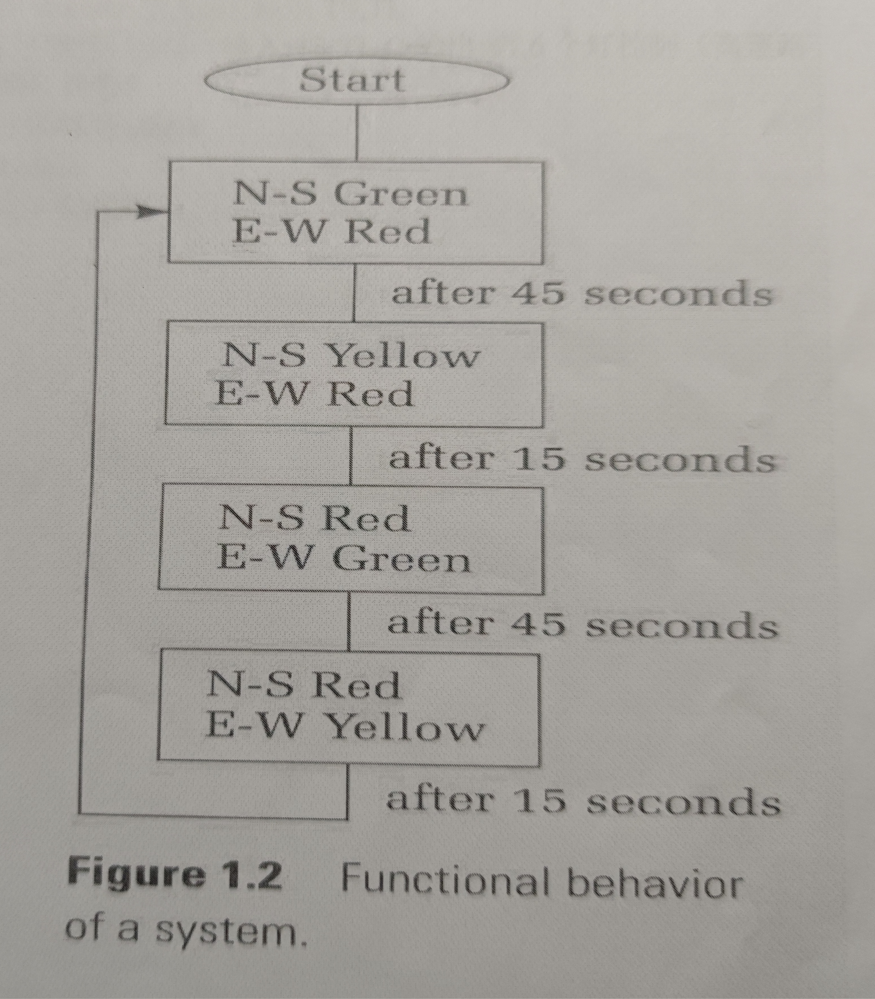

# 实验六 有限状态机

## 实验背景

​	有限状态机是一种用来进行对象行为建模的工具，其作用主要是描述对象在它的生命周期内所经历的状态序列，以及如何响应来自外界的各种事件。在计算机科学中，有限状态机被广泛用于建模应用行为、硬件电路系统设计、软件工程，编译器、网络协议、和计算与语言的研究。

## 实验内容

1、用System Verilog语言设计一个摩尔状态机，使其可以检测序列“1101”。

2、用System Verilog语言设计一个交通灯控制器，要求实现的功能：

- 交通灯位于四个方向（东、南、西、北）

- 南北和东西向在同一时间亮相同的灯

- 灯变化的次序为：绿-黄-红，循环

- 南北和东西向灯不同时为绿灯或黄灯

- 灯的持续时间：绿：45s，黄：15s，红：60s

- 拥有reset按钮，按下后回到初始状态

+++

**功能流程图：**

  

