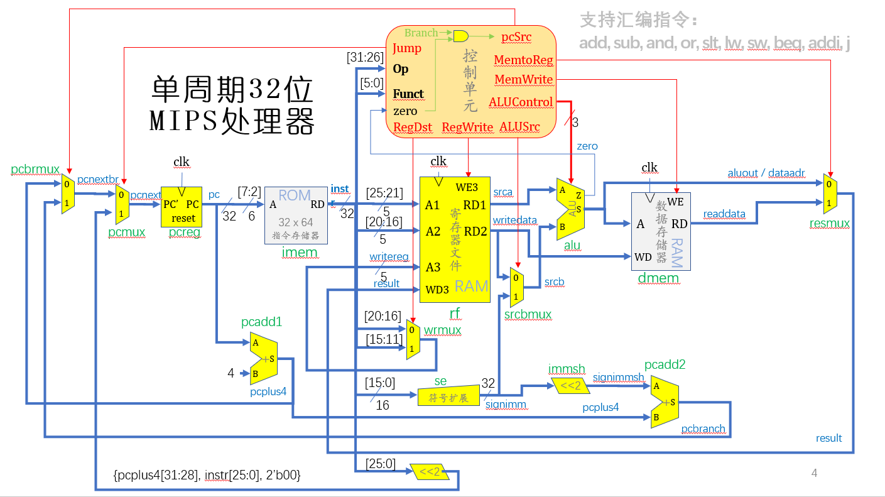
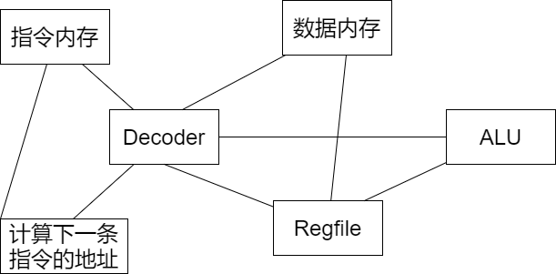

# 如何写一个CPU？

## 1. 我们已经学会了

* 任意给定功能的组合电路写法
* 触发器的写法

## 2. 什么是CPU？

* 执行指令
* 存储部分数据
* 计算下一条指令的地址

## 3. 指令集

这里演示的是`MIPS`的CPU。

`MIPS`是精简指令集架构（`RISC`）。`x86`是复杂指令集架构：

`MIPS`指令集的一部分指令如下：

| 指令格式            | [31:26] | [25:21] | [20:16] | [15:11] | [10:6] | [5:0]  | [15:0] |
| ------------------- | ------- | ------- | ------- | ------- | ------ | ------ | ------ |
| ADDU rd, rs, rt     | 000000  | rs      | rt      | rd      | 00000  | 100001 |        |
| ADDIU rt, rs, imm   | 001001  | rs      | rt      |         |        |        | imm    |
| SLT rd, rs, rt      | 000000  | rs      | rt      | rd      | 00000  | 101010 |        |
| SLTI rt, rs, imm    | 001010  | rs      | rt      |         |        |        | imm    |
| SLTU rd, rs, rt     | 000000  | rs      | rt      | rd      | 00000  | 101011 |        |
| SLTIU rt, rs, imm   | 001011  | rs      | rt      |         |        |        | imm    |
| AND rd, rs, rt      | 000000  | rs      | rt      | rd      | 00000  | 100100 |        |
| ANDI rt, rs, imm    | 001100  | rs      | rt      |         |        |        | imm    |
| LUI rt, imm         | 001111  | 00000   | rt      |         |        |        | imm    |
| NOR rd, rs, rt      | 000000  | rs      | rt      | rd      | 00000  | 100111 |        |
| OR rd, rs, rt       | 000000  | rs      | rt      | rd      | 00000  | 100101 |        |
| ORI rt, rs, imm     | 001101  | rs      | rt      |         |        |        | imm    |
| XOR rd, rs, rt      | 000000  | rs      | rt      | rd      | 00000  | 100110 |        |
| XORI rt, rs, imm    | 001110  | rs      | rt      |         |        |        | imm    |
| SLL rd, rt, sa      | 000000  | 00000   | rt      | rd      | sa     | 000000 |        |
| SRA rd, rt, sa      | 000000  | 00000   | rt      | rd      | sa     | 000011 |        |
| SRL rd, rt, sa      | 000000  | 00000   | rt      | rd      | sa     | 000010 |        |
| BEQ rs, rt, offset  | 000100  | rs      | rt      |         |        |        | offset |
| BNE rs, rt, offset  | 000101  | rs      | rt      |         |        |        | offset |
| J target            | 000010  |         |         |         |        |        |        |
| JAL target          | 000011  |         |         |         |        |        |        |
| JR rs               | 000000  | rs      | 00000   | 00000   | 00000  | 001000 |        |
| LW rt, offset(base) | 100011  | base    | rt      |         |        |        | offset |
| SW rt, offset(base) | 101011  | base    | rt      |         |        |        | offset |

## 4. 电路图

这是我们开学时看到的电路图：

我们也可以有更复杂的电路图：

可以对电路图进行抽象：

### 